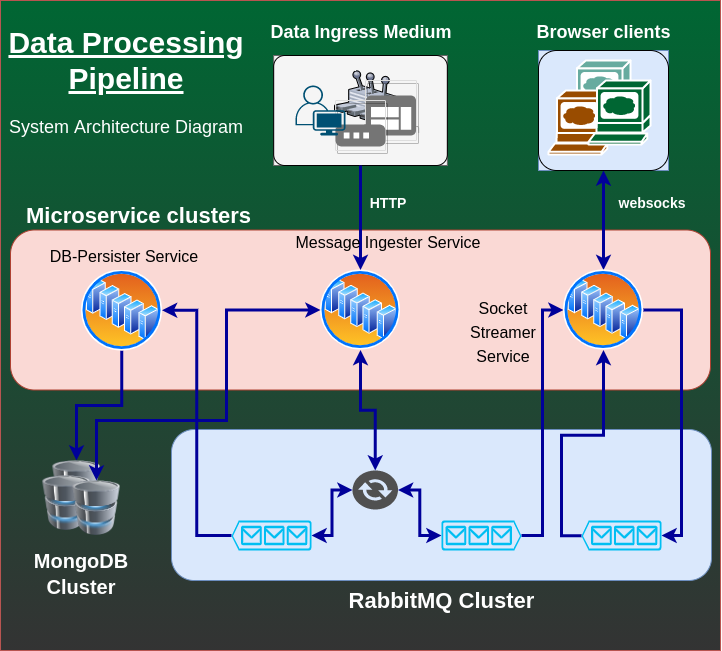

# Data Pipeline Processor (Persist & Websock Broadcast)

## Overview
This Application has been designed as an aggregation of 3 microservices (whose responsibilities
explained in later parts). For the Pub/Sub processing, RabbitMQ has been chosen as the Messaging system.

## Installation

The Project has been containerized and can be started with the docker compose. Since this is a microservice environment,
to avoid multiple redundant commands to execute, a shell script has been attached to the project. Please execute
the following command from the base folder of the project to start the application.

`./initialize-and-start.sh`

The command will take a while to build all the docker images of the microservices and initiate the docker compose.

Once the application is up and running visit [http://localhost:8787/ws](http://localhost:8787/ws) to begin

Note: The gateway and eureka services will take few mins to get ready after a cold start. So, incase if the requests or the page is getting a 503,
please hit it after a couple of minutes. You can also view the status of the services in this [http://localhost:8761](http://localhost:8761)

To skip to the Usage part - [click here](#demo-and-usage-instructions)

## System Design
The Entire System is designed in Spring Environment and many spring projects are utilized to achieve a robust microservice env.

**Spring Cloud Stream** is the backbone for the entire messaging infrastructure. It is cohesive and can plug and play many leading messaging systems.

**Spring WebSocket** is used for websockets streaming purpose. **RabbitMQ is used as a Message Relay host for subscribers** so that the application can scale easily.
For each subscriber a temporary queue will be created till the session is active. (Huge thanks to STOMP and AQMP).  

The System Design Architecture diagram is as follows.



### Microservices
#### Message-Ingester Service
This service acts as the API Endpoints host. The main task of this service are as follows.

- API to consume incoming messages and perform basic sanity and push them into the queue.
- API to pull all messages / paginated message list from the database (Paginated query will order the data by Timestamp ASC).
- Util Method to calculate the palindrome length as per the requirement.

#### Websock-Streamer Service
This service acts as the websocket server for the streamed message. This service listens to the queue which gets the pushed messages 
and broadcast those messages to all the subscribers.

- Act as the Websocket Server for the Browser client.
- Host a static HTML page which has js code to subscribe and listen to the websockets.
- Relay the Messages to RabbitMQ relay host to help the application scale properly.

#### DB-Persister Service
This service is straight forward. It listens to the messaging queue and once the message has arrived it will persist into the DB.

Note: Initial idea was to batch the push messages. But in order to reduce the delay in eventual consistency for the GET APIs, we're 
performing an instant push.

- Listen to queue and persist them into DB.

### External Systems

#### RabbitMQ - Messaging System
RabbitMQ was chosen for this design mainly because of Ordered Message Delivery in a Broadcast Scenario. (One queue needs to be broadcasted for all subscribers. Kafka will lose the edge over rabbit here).

RabbitMQ also acts a best Relay host Option for the Websockets since it supports STOMP through plugin directly.

Cloud Stream natively supports Kafka and RabbitMQ. Since kafka doesn't have a clear edge over Rabbit in both Scenario, Rabbit was chosen.

#### MongoDB - Data Persistence
The main reason to choose NoSQL over SQL is the requirement. Data Pipelines are mostly write heavy and ACID provided by SQL databases are not required here. Sharding should also be taken into account over time
and mongo (or many other NoSQL) provides a good edge over the SQL systems over here.
 
Mongo was also chosen for its simplicity in implementation. (Even though it doesn't support SpringJPA, MongoTemplates does the job neatly).

#### Eureka Server - Naming Service
The application is built to scale individually as per requirement rather than scaling the entire application. So Eureka provides better control for scaling by providing them an aggregated service name and balance the load over them.

#### Gateway Server - API Gateway Service
This Service is mainly used to load balance and expose all the scaled HTTP APIs under a single API Endpoint exposed to the outside world.

## Demo And Usage Instructions

The main mode of data ingress for the application is through the REST API. The data egress points are REST API and browser 
client listening to the Websockets broadcast.

### HOSTNAMES
These are the created hostname and their associated services.

|Hostname   |Service    |
|-----------|-----------|
|[http://localhost:8787/mi](http://localhost:8787/mi)| Message Ingester Service|
|[http://localhost:8787/ws](http://localhost:8787/ws)| WebSockets HTML Site    |
|[http://localhost:8761/](http://localhost:8761/)    | Eureka Server HTML Page to view the MS status | 

### API Endpoints
Here is the list of exposed API endpoints. These APIs are exposed in the Message Ingester Microservice 
#### Post new Message Payload
```http
POST /api/message
```
##### RequestBody
```json
{"content":"string_to_be_sent","timestamp":"yyyy-MM-dd HH:mm:ssZ"}
```

##### Sample Query
```shell script
curl --location --request POST 'localhost:8787/mi/message' \
--header 'Content-Type: application/json' \
--data-raw '{"content": "124424","timestamp": "2007-02-28 19:30:21+0530"}'
```
##### Response - STATUS CODE 202
```json
{
    "message": {
        "content": "string_to_be_sent",
        "timestamp": "2007-02-28 19:30:21+0530"
    },
    "status": "ACCEPTED"
}
```

#### Get All Messages
##### Request
```http
GET /api/message/all
```
##### Sample Query
```shell script
curl --location --request GET 'localhost:8787/mi/message/all'
```

##### Response - STATUS CODE 200
```json
[
  {
      "message": {
          "content": "string_to_be_sent",
          "timestamp": "2007-02-28 19:30:21+0530"
      },
      "status": "ACCEPTED"
  },
  {
      "message": {
          "content": "string_to_be_sent2",
          "timestamp": "2067-12-28 19:30:21+0100"
      },
      "status": "ACCEPTED"
  },
  {
      "message": {
          "content": "string_to_be_sent3",
          "timestamp": "2027-02-28 09:55:21-0400"
      },
      "status": "ACCEPTED"
  }
]
```

#### Get All Messages with Pagination
##### Request
```http
GET /api/message?page=0&size=25
```
##### Parameters
|Param  |Data Type  |Description|
|-------|-----------|-----------|
|page   |int        |page number should be > 0|
|size   |int        |page size should be > 0 < 25|

##### Sample Query
```shell script
curl --location --request GET 'localhost:8787/mi/message?page=0&size=4'
```
##### Response - STATUS CODE 200
```json
[
  {
      "message": {
          "content": "string_to_be_sent",
          "timestamp": "2007-02-28 19:30:21+0530"
      },
      "status": "ACCEPTED"
  },
  {
      "message": {
          "content": "string_to_be_sent",
          "timestamp": "2008-02-28 19:30:21+0530"
      },
      "status": "ACCEPTED"
  }
]
```